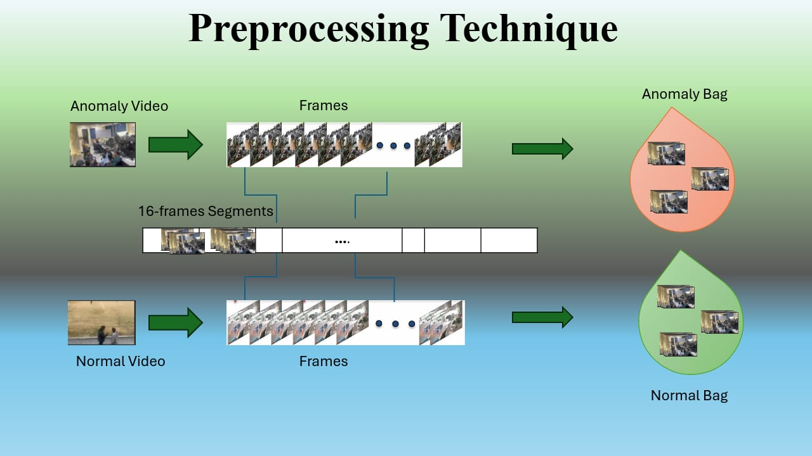
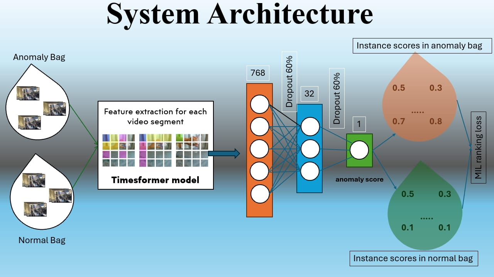
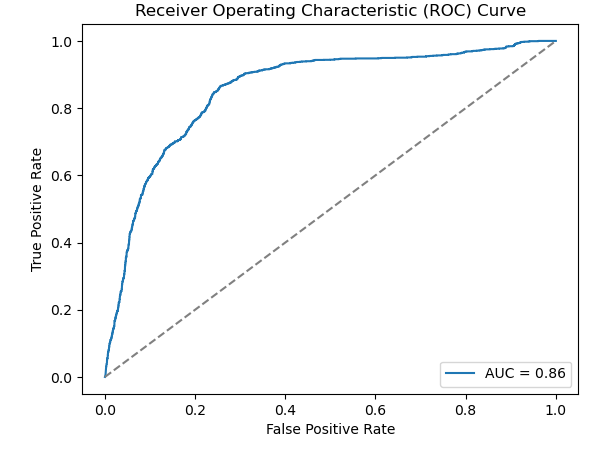
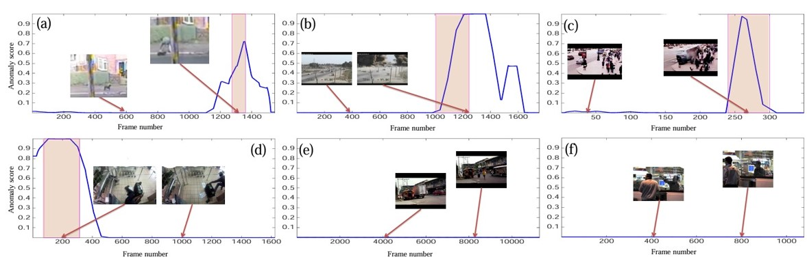

# Transformer-Anomaly-Detection-Surveillance
Transformer-based anomaly detection framework for surveillance videos using segment-level Multiple Instance Learning MIL

---

## 🔍 Overview

- ⏱ Real-time inference on video segments
- 🧠 Feature extraction with TimeSformer (CLS token)
  - TimesformerConfig {
  "attention_probs_dropout_prob": 0.0,
  "attention_type": "divided_space_time",
  "drop_path_rate": 0,
  "hidden_act": "gelu",
  "hidden_dropout_prob": 0.0,
  "hidden_size": 768,
  "image_size": 224,
  "initializer_range": 0.02,
  "intermediate_size": 3072,
  "layer_norm_eps": 1e-06,
  "model_type": "timesformer",
  "num_attention_heads": 12,
  "num_channels": 3,
  "num_frames": 8,
  "num_hidden_layers": 12,
  "patch_size": 16,
  "qkv_bias": true,
  "transformers_version": "4.49.0"
}
- 📦 MIL-based anomaly scoring
- 📊 Segment-level ROC-AUC evaluation with manual annotations

---

## 📊 Methodology

### Step 1: Segment-Level Feature Extraction

Each video is divided into **non-overlapping segments**. For each segment (16 frames), we extract a 768-dimensional [CLS] token feature using the **TimeSformer** model.



> 🔹 This step converts a video into a bag of temporal embeddings:  
> `Video = [segment_0_feat, segment_1_feat, ..., segment_N_feat]`  

---

### Step 2: Multiple Instance Learning (MIL)

The extracted segment features are passed through a lightweight **MIL classifier** that assigns an anomaly score to each segment. Only a weak video-level label is used during training.



---


### Step 4: Evaluation

Each segment is compared against **manually annotated anomaly intervals** using ROC-AUC. This ensures fine-grained, interpretable performance.






---

## 🚀 Quick Start

```bash
git clone https://github.com/umarzaib123/Transformer-Anomaly-Detection-Surveillance.git
cd Transformer-Anomaly-Detection-Surveillance
pip install -r requirements.txt

